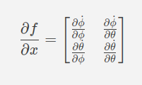
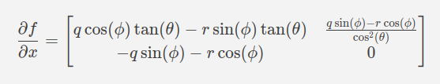
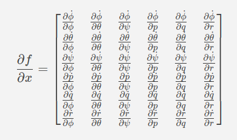
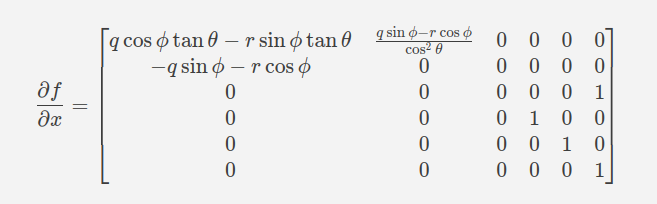
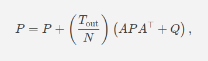
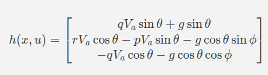
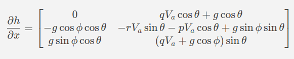



# Extended Kalman Filter for Quadcopter Attitude Estimation in Rust

## Abstract

This project implements an Extended Kalman Filter (EKF) in Rust to estimate the attitude (roll, pitch, and yaw angles) of a quadcopter using real-time gyroscope and accelerometer data. Drawing from the theoretical foundation provided by _Small Unmanned Aircraft: Theory and Practice_, the EKF was adapted and expanded to include yaw estimation, angular rates, and modular design for future enhancements such as GPS or vision integration.

The implementation is fully integrated into a ROS2 Rust node and operates with real-world IMU data, showcasing its practical application in robotics. The design leverages Rust’s high-performance and memory-safe features to create a robust and extensible solution for state estimation in dynamic systems.

This EKF not only serves as a critical component of the quadcopter's control system but also demonstrates the growing potential of Rust as a language for robotics applications. The accompanying README details the theoretical foundation, design considerations, and implementation specifics, making it a valuable resource for engineers and developers exploring Rust-based robotics.

## Why

Accurate attitude estimation is critical for quadcopter control, requiring sensor fusion due to the strengths and limitations of individual sensors:

-   **Gyroscope**: Measures angular velocity with high precision over short periods. However, it is prone to drift over time due to the absence of a stable reference like gravity, causing accumulated errors in measurements.
    
-   **Accelerometer**: Measures linear acceleration, including the constant effect of gravity, making it an excellent long-term reference for orientation. However, accelerometers are highly sensitive to high-frequency vibrations and rapid movements, making their short-term measurements noisy and unreliable.
    

By combining these sensors, we can achieve robust short-term and long-term attitude estimates:

-   The gyroscope serves as the primary sensor for the prediction phase of the EKF, offering accurate short-term dynamics.
-   The accelerometer provides long-term stability during the update phase, correcting the gyroscope's drift by referencing gravity.

This complementary fusion leverages the strengths of both sensors to produce a more reliable and accurate estimation of the quadcopter's attitude.
## Basis

This implementation builds upon the principles and techniques presented in the book _Small Unmanned Aircraft: Theory and Practice_ by Randal W. Beard and Timothy W. McLain. The book provides a comprehensive guide to Extended Kalman Filter (EKF) applications for small aerial vehicles, particularly for attitude estimation.

### Key Contributions from the Book:

-   The authors demonstrate the use of **gyroscope** and **accelerometer** data to estimate the roll and pitch angles of an aerial vehicle.
-   The state vector in their EKF implementation includes only **roll** and **pitch**, simplifying the problem to two degrees of freedom.
-   They provide detailed derivations of the **dynamics model** and **measurement model** used to fuse the gyroscope and accelerometer data effectively.
-   The book also walks through the two critical phases of the EKF:
    1.  **Prediction Phase**: Updates the state estimate using the dynamics model and gyroscope data.
    2.  **Update Phase**: Corrects the state estimate using the measurement model and accelerometer data.

While the book focuses on roll and pitch estimation, this implementation extends the state vector to include **yaw**, enabling full 3D attitude estimation (roll, pitch, yaw) suitable for quadcopters. Additionally, it translates the theory into a modular Rust-based implementation, leveraging the clarity of the book's methods while expanding their applicability.

This project owes significant inspiration to _Small Unmanned Aircraft: Theory and Practice_ and aims to make its concepts accessible to both hobbyists and professionals in the field of robotics and aerospace engineering.

## Design Decisions

This section outlines the key design decisions made during the implementation of the Extended Kalman Filter (EKF) for quadcopter attitude estimation and provides justifications for each choice.

----------

### 1. Expanded State Vector

The original EKF from _Small Unmanned Aircraft: Theory and Practice_ included only roll and pitch in its state vector. In this implementation, the state vector has been expanded to include:

-   **Yaw Angle**
-   **Roll Rate**
-   **Pitch Rate**
-   **Yaw Rate**

This allows for a more comprehensive attitude estimation that can be extended to more complex systems and future sensors.

#### **Yaw Angle**

-   **Why it's critical**: Yaw is essential for flight control and navigation.
-   **Challenges with yaw**: Unlike roll and pitch, yaw is independent of gravity (rotation around the z-axis does not relate to the gravitational force). This makes it impossible to use accelerometer data to correct for drift in yaw estimation.
-   **Current approach**: Yaw estimation is included in the prediction phase of the EKF but excluded from the update phase since no yaw-correcting sensor (e.g., magnetometer, GPS, or vision) is currently used.
-   **Future considerations**: This design supports future expansion when sensors like GPS or a vision system are introduced, enabling yaw correction.

----------

### 2. Roll, Pitch, and Yaw Rates

The original implementation assumes high-quality, pre-filtered sensor data and excludes angular rates (gyro data) from the EKF. However, this implementation includes roll, pitch, and yaw rates for the following reasons:

-   **Handling noisy gyro data**: The EKF inherently filters noise via the process noise covariance matrix (Q), making it a robust option for filtering angular rates.
-   **Consistency across the system**: Gyro data is a key input for cascaded PID controllers in the quadcopter's flight system. Including gyro data in the EKF ensures consistency between the estimated attitude and angular rates, avoiding potential discrepancies from separate filtering methods.
-   **Drift correction**: Unlike standalone filters like low-pass filters, the EKF can correct for gyro drift, ensuring long-term accuracy in angular rate estimation.

----------

### 3. Accelerometer Pre-Filtering

Accelerometer data is highly sensitive to vibration and noise. To address this:

-   A **low-pass Butterworth filter** is applied to the raw accelerometer data before it is used in the update phase of the EKF.
-   **Why pre-filter accelerometer data?**
    -   The accelerometer only serves as a secondary measurement for correcting gyro drift.
    -   High-frequency noise from accelerometers can degrade EKF performance.
    -   Pre-filtering reduces computational complexity by keeping the EKF matrices smaller.

----------

### 4. Airspeed Assumptions

The EKF equations account for airspeed (Va), but in this implementation:

-   Airspeed is set to 0.00 as no airspeed sensor is currently available.
-   This assumption aligns with the book's approach, which neglects airspeed.
-   **Why include airspeed in the equations?**
    -   It allows for future expansion if an airspeed sensor is added.
    -   The quadcopter is intended to operate in controlled environments where stable airflow minimizes the impact of this simplification.

----------

### 5. Programming Language: Rust

The decision to implement the EKF in Rust is driven by several factors:

-   **Performance and safety**: Rust provides high performance comparable to C++ while ensuring memory safety.
-   **Adoption in robotics**: Rust is increasingly used in robotics and embedded systems due to its modern features and ecosystem.
-   **Limited Rust EKF resources**: By creating a well-documented EKF implementation, this project contributes to the growing Rust robotics community, offering a reusable, open-source solution.

----------

### 6. Modularity and Expandability

The EKF implementation has been designed with modularity and future expandability in mind:

-   **Modularity**: Key matrices (state vector, covariance matrix, Q, and R) are defined in the EKF struct and initialized at creation, making the implementation easy to extend.
-   **Expandability**: The design anticipates adding more sensors (e.g., GPS, vision) to improve yaw correction and overall attitude estimation accuracy.

## Requirements

### Technical Requirements

1.  **Rust Installation**  
    Rust must be installed on your computer. Follow the official Rust installation guide.
    
2.  **IMU Data**
    
    -   **Units**:
        -   Gyroscope data must be in **rad/s** for all three axes (roll, pitch, yaw).
        -   Accelerometer data must be in **m/s²** for all three axes.
    -   **Orientation**:  
        Ensure your IMU data is oriented according to the **standard EKF frame of reference**:
        -   x: Positive in the north direction.
        -   y: Positive in the east direction.
        -   z: Positive in the down direction.
    -   **Unit Conversion**:  
        Most IMU sensors output raw data that needs to be converted to the required units. Ensure proper scaling and calibration are applied to get consistent measurements in rad/s and m/s².
3.  **Orientation Visualization**  
    The expected orientation for IMU data in an EKF can be seen in the image below:  
    _**(Insert EKF IMU orientation image here)**_
    
4.  **Non-Standard IMU Orientation**  
    If your IMU orientation differs from the standard EKF frame, you must adjust your data to match.
    
    -   Example: For my application, I used an **ICM-20948 IMU**, which has a non-standard orientation:
        -   y: Positive in the north direction.
        -   x: Positive in the east direction.
        -   z: Positive in the up direction.
    -   Correction applied:
        -   Flip x and y data.
        -   Multiply z data by −1.
    
    A visualization of the ICM-20948 IMU orientation is shown below:  
    _**(Insert ICM-20948 IMU orientation image here)**_
    

----------

### Practical Requirements

1.  **System Modeling**  
    The EKF estimates a system's state by combining:
    
    -   **Measurement Data**: Obtained from sensors such as gyroscopes and accelerometers.
    -   **Kinematic and Dynamic Models**: Mathematically describe the motion and forces acting on the system.
2.  **Understanding Your System**  
    To apply an EKF to your specific system:
    
    -   You must derive the **dynamic model** and **measurement model** for your system.
    -   Partial derivatives (Jacobians) of these models with respect to the state vector components must be calculated.
    -   This requires a solid understanding of your system's physics and kinematics.
3.  **EKF-Specific Models in This Implementation**
    
    -   **Dynamic Model, Measurement Model, Dynamic Jacobians, and Measurement Jacobians**:
        -   Derived from the book _"Small Unmanned Aircraft: Theory and Practice"_ by Randall W. Beard and Timothy W. McLain.
        -   Modified to fit the expanded state vector used in this EKF for quadcopter attitude estimation.
    -   These models are discussed in further detail later in this document.
4.  **General Applicability**  
    While this EKF is specifically designed for quadcopter attitude estimation, the principles and structure can be adapted to other systems. However, dynamic and measurement models, along with their respective Jacobians, must be developed for each unique system.

## Code Setup

### Importing the `nalgebra` Crate

[`nalgebra`](https://nalgebra.org/) is a powerful Rust crate (library) for performing linear algebra operations. It provides essential traits and methods for working with matrices and vectors, which are critical for implementing the matrix math required by an EKF. To use it, add `nalgebra` as a dependency in your project's `Cargo.toml` file.

The following line imports the specific types we'll be using:

	use nalgebra::{Matrix3, Matrix3x6, Matrix6, Vector6, Vector3};
-   `Matrix3`, `Matrix6`: Square matrices of size 3x3 and 6x6, respectively.
-   `Matrix3x6`: A 3x6 rectangular matrix.
-   `Vector6`, `Vector3`: Vectors of size 6 and 3, respectively.

These types simplify the process of defining and manipulating matrices and vectors in our EKF implementation.

### Declare constants

	pub const GRAVITY: f64 = 9.81; // Gravitational constant (m/s^2)
In Rust, constants are defined using the `const` keyword. They must have an explicitly declared type (`f64` in this case) and are evaluated at compile time, making them immutable.

Rust's privacy model makes all items private by default. To make the `GRAVITY` constant accessible outside of this module, we use the `pub` keyword, which designates it as public.

### Creating the EKF Struct

Rust does not follow a traditional object-oriented paradigm because it lacks inheritance and runtime polymorphism. However, it supports struct-based programming, which allows grouping related data fields into a single logical unit. For our EKF, we define a struct as follows:

	// EKF Struct
	pub struct EKF {
	    pub state: Vector6<f64>,                // State Vector: [roll (phi), pitch (theta), yaw (psi), roll rate (p), pitch rate (q), yaw rate (r)]
	    pub covariance: Matrix6<f64>,           // Covariance matrix P
	    pub process_noise: Matrix6<f64>,        // Process noise Q
	    pub measurement_noise: Matrix3<f64>,    // Measurement noise R
	    pub dt: f64,                            // Time step (0.01 for 100 Hz)
	    pub airspeed: f64,                      // Airspeed (v_a), initialized at 0
	}

This struct encapsulates the key components required for the EKF:

-   **State Vector (`state`)**: Tracks the system's state, including roll, pitch, yaw angles, and angular rates.
-   **Covariance Matrix (`covariance`)**: Represents the uncertainty of the state estimate.
-   **Process Noise (`process_noise`)**: A matrix representing system noise (Q), tuned for the specific dynamics of the system.
-   **Measurement Noise (`measurement_noise`)**: A matrix representing sensor noise (R), also tuned experimentally.
-   **Time Step (`dt`)**: The time interval between iterations of the EKF. In this implementation, it is set to 0.01 seconds (100 Hz update rate).
-   **Airspeed (`airspeed`)**: Included for completeness, though it is set to 0 in this implementation.

Key points about Rust structs:

-   Fields within the struct must be explicitly typed.
-   Fields are private by default but can be made public by prefixing them with the `pub` keyword, as seen here.
-   By using the `nalgebra` crate, the matrices and vectors in the struct are represented using optimized data structures for linear algebra.

This struct serves as the foundation for our EKF, holding all the necessary data and configuration for both the **predict** and **update** phases.

### Create a New EKF Instance

In Rust, an instance of a struct is created using an implementation block (`impl`). This allows us to define methods associated with the struct, such as constructors, functions, and utilities. The `new` function below is a commonly used convention for constructing a new instance of the struct.

	impl EKF {
    // Create a new EKF instance
    pub fn new() -> Self {
        EKF {
            state: Vector6::zeros(),                        // Initial state: zero roll, pitch, yaw, and angular rates
            covariance: Matrix6::identity() * 1.0,          // Initialize P with some uncertainty
            process_noise: Matrix6::identity() * 0.1,       // Process noise Q (TUNED EXPERIMENTALLY)
            measurement_noise: Matrix3::identity() * 0.2,    // Measurement noise R (TUNED EXPERIMENTALLY)
            dt: 0.01,
            airspeed: 0.0,                                  // Assume airspeed is 0 for now; future nonzero airspeed compatibility included
        }
    }

In this `impl` block:

-   **`pub` modifier**: Makes the `new` function publicly accessible, allowing you to create an EKF instance from outside this module.
-   **`Self` type alias**: Refers to the struct being implemented (in this case, `EKF`). Returning `Self` is a Rust shorthand for returning the type of the struct.
-   **Initialization**: The `new` function initializes the struct fields with default or starting values, preparing the EKF for its first iteration.

----------

#### Initialization Details

1.  **State Vector (`state`)**:  
    The state vector is initialized as a zero vector (`Vector6::zeros()`), meaning all components (roll, pitch, yaw, and angular rates) start at 0. This represents the initial "assumed" state of the system. The state vector is dynamic, meaning it will be updated in every iteration of the EKF to reflect the estimated system state.
    
2.  **Covariance Matrix (`covariance`)**:  
    The covariance matrix is initialized as a 6x6 identity matrix, scaled by a magnitude of `1.0`. This represents initial uncertainty in the state estimation. Like the state vector, the covariance matrix is dynamic and evolves with each EKF iteration based on the prediction and update steps.
    
3.  **Process Noise Matrix (`process_noise`)**:  
    The process noise matrix (`Q`) accounts for uncertainty or errors in the system dynamics model. It is initialized here as a 6x6 identity matrix scaled by `0.1`, but this value is arbitrary and must be tuned experimentally for the specific application. Once tuned, the matrix remains static during EKF iterations.
    
4.  **Measurement Noise Matrix (`measurement_noise`)**:  
    The measurement noise matrix (`R`) accounts for noise or errors in the sensor data. It is similarly initialized as a 3x3 identity matrix scaled by `0.2`, but this value is also arbitrary and requires experimental tuning. Like `Q`, it remains static during EKF iterations.
    
5.  **Time Step (`dt`)**:  
    The time step represents the interval between EKF iterations and should match the frequency of incoming sensor data. In this implementation, `dt` is set to `0.01` seconds, which corresponds to a 100 Hz data rate (common for gyroscope and accelerometer sensors). In more complex implementations, the time step could vary between the prediction and update phases.
    
6.  **Airspeed (`airspeed`)**:  
    Airspeed is included as a variable in the struct for future extensibility. For now, it is set to `0.0` since there are no airspeed sensors in this implementation. However, the equations are designed to incorporate airspeed should it be measured in future applications.
    

The `new` method ensures that all fields of the EKF struct are properly initialized with starting values. This approach centralizes the initialization logic, ensuring consistency and reducing errors when creating new EKF instances. It also makes the EKF flexible for future modifications, such as incorporating additional sensors or tuning the noise matrices (`Q` and `R`).

This constructor reflects Rust's strong emphasis on safety and correctness by requiring explicit initialization for all fields, ensuring the EKF starts with well-defined values.  

# The Extended Kalman Filter

The Extended Kalman Filter (EKF) consists of two main phases: the **Prediction Phase** and the **Update Phase**. Each phase plays a critical role in estimating the state of the system (in this case, the quadcopter's attitude) by combining dynamic modeling and sensor measurements. Below is a high-level outline of the steps in each phase. Subsequent sections will provide detailed explanations of these steps, including both the theoretical basis and practical implementation in Rust.

----------

### **Prediction Phase**

The **Prediction Phase** uses the system's dynamics to estimate the next state of the system and the associated uncertainty. This phase is driven by the dynamic model of the system.

1.  **Compute the Dynamic Model, f(x, u):**  
    Use the system's dynamics to calculate how the state evolves over time, based on the previous state and control inputs (if any). This accounts for how the quadcopter's attitude changes based on gyroscope readings.
    
2.  **Update the State Vector:**  
    Use the computed dynamic model to update the state vector, which represents the system's estimated attitude and angular rates.
    
3.  **Calculate the Dynamics Jacobian:**  
    Derive the partial derivatives of the dynamic model with respect to the state vector to compute the dynamics Jacobian matrix, which captures how small changes in the state affect the dynamics.
    
4.  **Update the Covariance Matrix:**  
    Use the dynamics Jacobian and the process noise matrix (Q) to update the covariance matrix, which represents the uncertainty in the state estimation.
    

----------

### **Update Phase**

The **Update Phase** incorporates sensor measurements (in this case, accelerometer data) to correct the predicted state and reduce uncertainty. This phase ensures long-term accuracy by counteracting drift in the gyroscope's estimates.

1.  **Compute the Measurement Model, h(x, u):**  
    Use the measurement model to predict what the sensor measurements should be based on the current state estimate.
    
2.  **Compute the Innovation:**  
    Calculate the difference between the actual sensor measurements and the predicted measurements from the measurement model. This difference (called the innovation) indicates how much correction is needed.
    
3.  **Compute the Measurement Jacobian:**  
    Derive the partial derivatives of the measurement model with respect to the state vector to compute the measurement Jacobian matrix, which captures how the state affects the sensor measurements.
    
4.  **Compute the Innovation Covariance:**  
    Use the measurement Jacobian, covariance matrix, and measurement noise matrix R to compute the innovation covariance, which represents the uncertainty in the innovation.
    
5.  **Compute the Kalman Gain, K:**  
    Calculate the Kalman Gain, which balances the trust between the predicted state and the sensor measurements when updating the state.
    
6.  **Update the State Vector:**  
    Use the Kalman Gain and the innovation to update the state vector, correcting the predicted state using the sensor measurements.
    
7.  **Update the Covariance Matrix:**  
    Use the Kalman Gain and the measurement Jacobian to update the covariance matrix, reducing uncertainty in the corrected state estimate.
    

----------

This structure outlines the logical flow of the EKF and highlights the roles of the dynamic and measurement models, as well as the iterative process of combining predictions with sensor corrections. Each step ensures that the system state estimate is as accurate as possible while accounting for uncertainty in both the system's dynamics and the sensor data.

## Prediction Phase

The **Prediction Phase** estimates the system's next state based on the current state and the system's dynamics. In our implementation, this entire phase is encapsulated in the `predict` method. This method computes the dynamic model, updates the state vector, and calculates the dynamics Jacobian and covariance matrix.

### Declaring the Predict Method

We start by creating the `predict` method and declaring it as public using `pub fn`. The method takes a single argument `gyro`, which is an array of size 3 (`[f64; 3]`). This array contains gyroscope data for the x, y, and z axes in units of rad/s (angular velocities).

	    pub fn predict(&mut self, gyro: [f64; 3]) {
	        //Extract state variables for readability
	        let phi = self.state[0];                // Roll angle
	        let theta = self.state[1];              // Pitch angle
	        let _psi = self.state[2];                // Yaw angle
	        let p = gyro[0];                        // Roll rate (gyro x)
	        let q = gyro[1];                        // Pitch rate (gyro y)
	        let r = gyro[2];                        // Yaw rate (gyro z)
	        let dt = self.dt;                       // dt

#### Variable Explanation

1.  **State Variables**:
    
    -   `phi` (roll angle) and `theta` (pitch angle) are extracted from the state vector for readability.
    -   `_psi` (yaw angle) is also extracted but is prefixed with `_` because it is not directly used in the prediction step. The `_` tells the Rust compiler to ignore unused variable warnings. Including it improves code readability and highlights that yaw is part of the state vector.
2.  **Gyroscope Data**:
    
    -   `p`, `q`, and `r` represent the angular velocities (roll rate, pitch rate, and yaw rate) obtained from the gyroscope input. These are essential inputs for the dynamic model.
3.  **Time Step**:
    
    -   `dt` is the time interval between iterations. This value ensures that the integration of angular velocities into angles is time-accurate.

----------

### Compute the Dynamic Model: f(x, u)

The dynamic model, f(x,u), describes how the state evolves over time based on the system's dynamics. In the case of the quadcopter, it predicts the roll, pitch, and yaw angles using gyroscope data and the previously estimated angles. This nonlinear propagation model ensures that the state vector reflects realistic dynamics.

#### Dynamic Model Equations

The dynamic model uses the following equations for roll (ϕ) and pitch (θ) as defined in the book: 

Where:
- ϕ and θ represent the roll and pitch angles.
-   p, q, and r are the angular velocities (roll rate, pitch rate, and yaw rate) from the gyroscope.
-   ξϕ and ξθ​ are process noise terms, which are accounted for by the process noise matrix Q.

The yaw angle (ψ\) is updated using a simpler propagation model because yaw is not affected by gravity or the roll and pitch dynamics: $ψ˙​=r$

Here, yaw is estimated by directly integrating the yaw rate (r) over time. This integration assumes that yaw dynamics are independent of roll and pitch.

#### Code Implementation

The Rust implementation of the dynamic model is as follows:

		    // Dynamics: f(x, u)
	        let roll_dot = p + q * phi.sin() * theta.tan() + r * phi.cos() * theta.tan();
	        let pitch_dot = q * phi.cos() - r * phi.sin();
	        let yaw_dot = r; // Yaw is simple integration of yaw rate
#### Explanation of the Code

1.  **Roll Dynamics**:
    
    -   ϕ​ is calculated using p, q, and r as well as the previously estimated roll (ϕ) and pitch (θ).
    -   The equation accounts for trigonometric relationships between angular velocities and roll/pitch dynamics.
2.  **Pitch Dynamics**:
    
    -   θ is calculated similarly, with dependencies on q, r, and the previously estimated roll (ϕ).
3.  **Yaw Dynamics**:
    
    -   ψ​ is updated directly using r, the yaw rate from the gyroscope. No trigonometric relationships are involved since yaw is independent of gravity.

This step computes the dynamic evolution of the state vector using only gyroscope data and the dynamic model. In subsequent steps, this model's output will be used to update the state vector and the covariance matrix.

### Update the State Vector

The state vector is updated with the predicted dynamics from the **Dynamic Model**, f(x,u), using the gyroscope data (p, q, and r) as angular velocity inputs. Each component of the state vector is updated iteratively based on the roll (ϕ), pitch (θ), and yaw (ψ) dynamics.

#### Code Implementation

		    // Update state with predicted dynamics
	        self.state[0] += roll_dot * dt;         // Update roll
	        self.state[1] += pitch_dot * dt;        // Update pitch
	        self.state[2] += yaw_dot * dt;          // Update yaw
	        self.state[3] = p;                      // Update roll rate
	        self.state[4] = q;                      // Update pitch rate
	        self.state[5] = r;                      // Update yaw rate

1.  **Roll, Pitch, and Yaw Angles**:
    
    -   The angles (ϕ,θ,ψ) are updated using their respective rates of change ($\dot{ϕ}$, $\dot{θ}$, $\dot{ψ}$) computed in the **Dynamic Model**, scaled by the time step (dt).
2.  **Angular Velocities**:
    
    -   The angular velocities (p,q,r) are directly updated with the gyroscope measurements. This allows the EKF to treat the angular rates as dynamic state variables and refine them based on noise considerations.

This update ensures the state vector reflects the predicted system dynamics at each iteration.

----------

### Compute the Dynamic Jacobian

The **Dynamic Jacobian** (∂f/∂x​) is a first-order linear approximation that quantifies how the state vector components influence each other in a nonlinear dynamic system. It is a matrix of partial derivatives, where each element represents the sensitivity of one state variable's rate of change to changes in another state variable.

#### The Jacobian Matrix

For a state vector of size n, the Jacobian is an n×n  matrix. Each row contains the partial derivatives of the time derivative of one state variable with respect to all components of the state vector.

For example, the **Dynamic Jacobian** in the book (state vector: [ϕ,θ]) is:

Populating this matrix with the partial derivatives derived in the book, we get:

Since our state vector includes six components ([ϕ,θ,ψ,p,q,r]), the Jacobian matrix expands to a 6x6 matrix:

### Our 6x6 Dynamic Jacobian Matrix

In our implementation:

1.  Rows 1-3 correspond to the roll, pitch, and yaw angles. The partial derivatives are derived from the rotational dynamics equations.
2.  Rows 4-6 correspond to the angular rates (p,q,r) and remain as identity rows. This is because we directly use the angular rates from the gyroscope without propagating them dynamically.

The matrix becomes:

#### Code Implementation

The code implementation for this Jacobian is as follows:

		    // Jacobian of dynamics: ∂f/∂x
		    let mut f_jacobian = Matrix6::identity();
		    
		    // Roll dynamics (first row)
	        f_jacobian[(0, 0)] = (q * phi.cos() * theta.tan() - r * phi.sin() * theta.tan()) * dt;    // ∂roll_dot/∂phi
	        f_jacobian[(0, 1)] = ((q * phi.sin() - r * phi.cos()) / theta.cos().powi(2)) * dt;        // ∂roll_dot/∂theta
	        
	        // Pitch dynamics (second row)
	        f_jacobian[(1, 0)] = (-q * phi.sin() - r * phi.cos()) * dt; // ∂pitch_dot/∂phi
	        f_jacobian[(1, 1)] = 0.0; // No significant dependency of ∂pitch_dot/∂theta
	        
	        // Yaw dynamics (third row)
	        f_jacobian[(2, 2)] = 0.0; // ∂yaw_dot/∂yaw
	        f_jacobian[(2, 5)] = 1.0; // ∂yaw_dot/∂r
	        // Angular rates (rows 4, 5, 6) remain identity
	        // These entries are unaffected by dynamics and stay initialized to 1.0

### Update the Covariance Matrix

The final step in the **Prediction Phase** is updating the **Covariance Matrix**, which represents the uncertainty in the state estimate. This step accounts for how the system dynamics and process noise contribute to the uncertainty. The mathematical equation for this update is:

where:

-   P: The covariance matrix, which was initialized as a 6×6 identity matrix with some magnitude during the EKF initialization.
-   Tout/N: The time step (dt), which we set to 0.01 seconds (100 Hz).
-   A: The Jacobian matrix of the dynamics, (sometimes F is used) calculated earlier in the **Compute the Dynamic Jacobian** step.
-   Q: The process noise matrix, initialized as a 6×6 identity matrix scaled by 0.1 in this implementation. **The process noise matrix Q must be tuned experimentally** to appropriately reflect the noise in the system dynamics.

----------

#### Explanation

-   **Jacobian Matrix (A/F):** This captures how the state evolves dynamically. It propagates the uncertainty through the dynamics model f(x,u).
-   **Process Noise (Q):** Represents the uncertainty due to external or unmodeled influences on the dynamics. Since we don't have a perfect model of the quadcopter's dynamics, this matrix accounts for those inaccuracies.
-   **Time Step (dt):** Scales the entire update process to account for the rate at which the system evolves over time.

The updated covariance matrix quantifies the propagated uncertainty in the state estimate after considering how the dynamics model evolves the state.

----------

#### Code Implementation

The corresponding Rust code for updating the covariance matrix is:

			// Predict covariance: P' = FPFᵀ + Q

			self.covariance =  self.covariance + (dt  * (f_jacobian  *  	self.covariance *  f_jacobian.transpose() +  self.process_noise));

			}
1.  **Matrix Operations**:
    
    -   FPFᵀ: The covariance matrix is transformed by the Jacobian matrix (F) to propagate the uncertainty through the dynamics.
    -   Q: The process noise matrix is added to account for system noise.
    -   dt: The time step scales the entire expression.
2.  **Initialization**:
    
    -   For the first iteration, the covariance matrix P is initialized to an identity matrix scaled by 1.0.
    -   The **process noise matrix Q** is also initialized to an identity matrix scaled by 0.1. You may need to adjust these values based on your specific system.
3.  **Dynamic Update**:
    
    -   With each iteration, the covariance matrix P is updated to reflect the propagated uncertainty based on the current state, dynamics, and noise.

----------

#### Key Notes

-   **Importance of Tuning Q:** The values in the process noise matrix Q are critical to achieving good performance in the EKF. If Q is too small, the filter will overly trust the dynamics model, potentially failing to account for unmodeled behaviors. If Q is too large, the filter will become overly cautious, slowing down convergence.
-   This step ensures that the EKF properly captures the propagated uncertainty after predicting the next state.

## Update Phase

The **Update Phase** refines the predicted state estimate by incorporating actual sensor readings. This is where the EKF "corrects" its prediction from the **Prediction Phase** by comparing predicted measurements (from the measurement model h(x,u) with actual measurements (from the accelerometer).

We encapsulate this entire phase in the `update` method. It begins by extracting state variables for readability, similar to the **Prediction Phase**.

		/// Update step (nonlinear measurement model)
		pub  fn  update(&mut  self, accel: [f64;3]) {
			// Extract state variables for readability
			let  phi  =  self.state[0]; // Roll angle
			let  theta  =  self.state[1]; // Pitch angle
			let  p  =  self.state[3]; // Roll rate (gyro x)
			let  q  =  self.state[4]; // Pitch rate (gyro y)
			let  r  =  self.state[5]; // Yaw rate (gyro z)
			let  v_a  =  self.airspeed; // Airspeed 9assumed 0 for now)

At this point in the EKF, the **state vector** and **covariance matrix** have already been predicted using gyroscope data and the dynamics model. The **Update Phase** uses accelerometer measurements to further refine the state.

----------

### Compute the Measurement Model: h(x,u)

The **Measurement Model** serves a role similar to the **Dynamics Model, f(x,u)** in the prediction phase. However, instead of predicting the state evolution, the measurement model maps the current state vector to the expected sensor measurements. It defines the relationship between the state components (e.g., roll, pitch, yaw angles) and sensor readings (e.g., accelerometer outputs).

-   The measurement model h(x,u) predicts what the sensors **should** measure, given the current state and system dynamics.
-   By comparing this prediction with the actual sensor readings, the EKF identifies and corrects discrepancies, improving the state estimate.

For this EKF, the measurement model relates the **state vector** to the expected accelerometer readings. These equations project gravitational acceleration (g) and angular effects (p,q,r) onto the accelerometer's axes using trigonometry. The derived equations from the book are as follows:

#### Explanation of Components:

1.  **Roll (hϕ)**:
    
       
    - $qV_a \sin{\theta}$: Contribution from angular velocity in the pitch axis scaled by airspeed.
    - $g \sin{\theta}$: Contribution from gravity projected onto the roll axis.
2.  **Pitch (hθ)**:
    - $rV_a \cos{\theta}$:	Contribution from angular velocity in the yaw axis scaled by airspeed.
    - $-pV_a \sin{\theta}$:	Contribution from angular velocity in the roll axis scaled by airspeed.
    - $-g \cos{\theta} \sin{\phi}$:	Gravity's effect projected onto the pitch axis.
3.  **Yaw (hψ)**:
    
    - $-qV_a \cos{\theta}$: Contribution from angular velocity in the pitch axis scaled by airspeed.
    - $-g \cos{\theta} \cos{\phi}$: Gravity's effect projected onto the yaw axis.

----------

#### Code Implementation

The code implementation for the measurement model is below:

			// Measurement Model: h(x)

			let  h_roll  =  v_a  *  q  *  theta.sin() + GRAVITY *  theta.sin(); // q V_a sin(theta) + g sin(theta)
			let  h_pitch  =  v_a  * (r  *  theta.cos() -  p  *  theta.sin()) - GRAVITY *  theta.cos() *  phi.sin(); // r V_a cos(theta) - p V_a sin(theta) - g cos(theta) sin(phi)
			let  h_yaw  =  -v_a  *  q  *  theta.cos() - GRAVITY *  theta.cos() *  phi.cos(); // -q V_a cos(theta) - g cos(theta) cos(phi)

			let  h  =  Vector3::new(h_roll, h_pitch, h_yaw);
#### Key Notes:

1.  **Nonlinear Mapping**: The measurement model is nonlinear because it uses trigonometric functions (sin⁡, cos⁡, tan⁡) to relate state variables to sensor readings.
2.  **Independent Axes**: Each axis (roll, pitch, yaw) has its own contributions based on gravity and angular rates.
3.  **Code Implementation**:
    -   hϕ, hθ, hψ​: Each component is computed separately for clarity.
    -   The final h(x,u) is a 3×1 vector, matching the dimension of the accelerometer measurements.

In the **Update Phase**, this measurement model is a key step. It allows the EKF to compare predicted measurements h(x,u) with actual measurements from the accelerometer, leading to the calculation of the **Innovation** (discrepancy between predicted and actual sensor readings).

### Compute Innovation

The **Innovation** represents the difference between the actual measurement from sensors (z) and the predicted measurement (h(x,u)), based on the current state estimate. It quantifies the discrepancy between what the sensors measure and what the EKF predicts. Mathematically, this is expressed as: $y = z - h(x, u)$

where:

-   y: Innovation.
-   z: Actual sensor measurements.
-   h(x,u): Predicted sensor measurements from the **Measurement Model**.

----------

#### Purpose of Innovation

The innovation is a crucial component in the **Update Phase**:

1.  **Small Innovation**: Indicates the prediction closely matches the actual measurement. In this case, the Kalman gain adjusts the state estimate minimally.
2.  **Large Innovation**: Suggests the prediction is significantly different from the actual measurement, requiring the Kalman gain to heavily adjust the state estimate.

The innovation directly influences the Kalman gain (K) and therefore determines how much weight the EKF assigns to the actual sensor measurements compared to the predicted state.

----------

#### Code Implementation

Below is the implementation of the innovation calculation in Rust:

			// Innovation: y = z - h(x)

			let  z  =  Vector3::new(accel[0], accel[1], 0.0); // Measured accelerometer data; yaw left as 0
			let  y  =  z  -  h;

### Compute the Measurement Jacobian

The **Measurement Jacobian** quantifies how the predicted measurements h(x,u) change with respect to the state vector variables. In simpler terms, it determines the sensitivity of the predicted sensor outputs to small changes in the state vector.

#### Purpose of the Measurement Jacobian

The Jacobian is crucial for:

1.  **Calculating the Kalman Gain**: Determines how much weight to assign to the actual measurement versus the predicted state during the update phase.
2.  **Propagating Measurement Information**: Helps incorporate sensor data to correct the state estimate and reduce uncertainty.

----------

#### Measurement Jacobian in the Book

The book uses a smaller state vector with only roll and pitch angles (ϕ,θ) and defines a 3×2 Jacobian matrix:

Here:

-   **Rows** correspond to the measurement outputs (hroll, hpitch, hyaw).
-   **Columns** correspond to the two components of the state vector (roll and pitch angles).

Each entry is the partial derivative of one measurement output with respect to one state vector component.

----------

#### Adapting the Measurement Jacobian for a Larger State Vector

Since our state vector has 6 components (ϕ,θ,ψ,p,q,r), the Jacobian expands to a 3×6 matrix. However:

-   We do not update yaw (ψ) due to the absence of a magnetometer, GPS, or vision sensor. **Column 3 (yaw) is all zeros.**
-   We do not update angular rates (p,q,r) due to the absence of a second gyroscope. **Columns 4–6 are all zeros.**

The resulting measurement Jacobian becomes:

This design makes the EKF modular and expandable:

-   A magnetometer, GPS, or vision system can be added later to update yaw without rewriting the EKF.
-   A second gyroscope could be added to update angular rates without requiring major modifications.

----------

#### Code Implementation

Below is the Rust implementation of the 3×6 Measurement Jacobian. A 3×6 matrix of zeros is initialized, and only the required indices are populated with partial derivatives:

rust

Copy code

			// Jacobian of measurement model: ∂h/∂x
			let  mut  h_jacobian  =  Matrix3x6::zeros();

			// Row 1: h_roll (qV_a sin θ + g sin θ)
			h_jacobian[(0, 1)] =  v_a  *  q  *  theta.cos() + GRAVITY *  theta.cos(); // ∂h_roll/∂theta

			// Row 2: h_pitch (rV_a cos θ - pV_a cos θ + g sin φ sin θ)
			h_jacobian[(1, 0)] =  -GRAVITY *  phi.cos() *  theta.cos(); // ∂h_pitch/∂phi
			h_jacobian[(1, 1)] =  -r  *  v_a  *  theta.sin() -  p  *  v_a  *  theta.cos() + GRAVITY *  phi.sin() *  theta.sin(); // ∂h_pitch/∂theta			  

			// Row 3: h_yaw (-qV_a cos θ - g cos θ cos φ)
			h_jacobian[(2, 0)] = GRAVITY *  phi.sin() *  theta.cos(); // ∂h_yaw/∂phi
			h_jacobian[(2, 1)] = (q  *  v_a  + GRAVITY *  phi.cos()) *  theta.sin(); // ∂h_yaw/∂thetas

### Compute the Innovation Covariance

The **Innovation Covariance** (S) quantifies the uncertainty in the innovation (y) by accounting for both:

1.  **Prediction Phase Uncertainty**: Captured by the covariance matrix P, which reflects how uncertain the state prediction is.
2.  **Measurement Noise**: Captured by the noise covariance matrix R, which represents the inherent noise in the sensor measurements.

#### Purpose of the Innovation Covariance

The innovation covariance ensures the update phase incorporates measurement data in a statistically optimal way based on relative uncertainties:

-   **Higher S**: Indicates more uncertainty in the measurement prediction. In this case, the Kalman Gain (K) will rely more heavily on the prediction and less on the measurement.
-   **Lower S**: Indicates higher confidence in the measurement prediction. The Kalman Gain will give greater weight to the measurement data.

This mechanism balances prediction and measurement contributions, ensuring robust state estimation even in the presence of noisy data.

----------

#### Mathematical Representation

The Innovation Covariance is defined as: $S = H_i P H_i^\top + R_i$

where:

-   Hi: Measurement Jacobian matrix, representing the sensitivity of the predicted sensor outputs to changes in the state vector.
-   P: Covariance matrix from the prediction phase.
-   Ri: Measurement noise covariance matrix, initialized as a 3×3 identity matrix scaled by 0.2 when the EKF instance was created. **This matrix must be tuned experimentally.**

----------

#### Code Implementation

Below is the Rust implementation of computing the Innovation Covariance:

			// Innovation covariance: S = HPHᵀ + R
			let  s  =  h_jacobian  *  self.covariance *  h_jacobian.transpose() +  self.measurement_noise;
#### Key Points:

-   The innovation covariance S directly impacts the Kalman Gain (K) calculation, which determines how much the state estimate should be adjusted in the update phase.
-   The R matrix reflects the sensor's reliability and must be experimentally tuned to achieve an optimal balance between prediction and measurement data.

This step ensures the EKF systematically handles uncertainties, enabling accurate and reliable state estimation.

### Compute the Kalman Gain, K

The **Kalman Gain** (K) is one of the most critical components of the Extended Kalman Filter. It optimally determines how much weight to assign to the measurement versus the prediction when updating the state estimate.

#### Purpose of the Kalman Gain

K ensures the EKF dynamically balances the relative trust between:

1.  **State Prediction**: The estimate based on the model dynamics from the prediction phase.
2.  **Sensor Measurement**: The actual measurement from the sensors in the update phase.

#### Key Insights:

-   If the **measurement uncertainty R** is **low** (indicating a highly accurate sensor), K gives more weight to the measurement.
-   If the **state prediction uncertainty P** is **low** (indicating a high-confidence model prediction), K gives more weight to the prediction.
-   A **high K** means more trust in the measurement.
-   A **low K** means more trust in the prediction.

The Kalman Gain enables the EKF to adapt dynamically in real-time to changing uncertainties in the system and sensor measurements.

----------

#### Mathematical Representation

The Kalman Gain is calculated as: $K = P H_i^\top S^{-1}$

where:

-   P: Covariance matrix from the prediction phase, representing the prediction uncertainty.
-   Hi: Measurement Jacobian matrix, capturing how the state affects the measurement outputs.
-   S: Innovation covariance, quantifying the combined uncertainty of the prediction and the measurement.

----------

#### Practical Implications of K

1.  **Dynamic Balancing**: Since K is recalculated at every iteration, the EKF continuously adjusts the balance between prediction and measurement.
2.  **Optimal Fusion**: K ensures that the state update is performed in a statistically optimal way, leveraging both the system model and sensor data.
3.  **Error Reduction**: The influence of K minimizes the overall error in the state estimation.

----------

#### Code Implementation

Below is the Rust implementation of the Kalman Gain:	
		  
			// Kalman gain: K = P Hᵀ S⁻¹
			let  k  =  self.covariance *  h_jacobian.transpose() *  s.try_inverse().unwrap();

The Kalman Gain serves as the bridge between prediction and measurement, dynamically adjusting the system's state estimate and ensuring robust performance in a noisy environment. It reflects the adaptability and power of the EKF.

### Update the State Vector

In this step, the EKF **refines its estimate of the system state** by incorporating the sensor measurements (via the innovation) and the predicted state (via the Kalman Gain). This is the step where the “update” of the **update phase** happens.

#### Mathematical Representation:

The updated state vector is defined as: $\hat{x} = \hat{x} + K \cdot \left( y - h(\hat{x}, u) \right)$

where:

-   $\hat{x}$: Current state vector estimate (from the prediction phase).
-   K: Kalman Gain, computed earlier.
-   y: Innovation (difference between actual and predicted measurements).

The Kalman Gain (K) dynamically determines the influence of the measurement versus the prediction, and the Innovation (y) quantifies the difference between actual sensor data and predicted measurements. Together, they refine the state estimate to optimally fuse prediction and measurement.

#### Output:

In our implementation, the output of this step is the **updated state vector**, which includes:

-   Roll angle (ϕ)
-   Pitch angle (θ)
-   Yaw angle (ψ)
-   Roll rate ( p )
-   Pitch rate ( q )
-   Yaw rate ( r )

----------

#### Code Implementation:

Below is the Rust implementation of updating the state vector:

			// Update state: x = x + Ky
			self.state =  self.state +  k  *  y;

### Update the Covariance Matrix

This is the **final step** in the Extended Kalman Filter, where the covariance matrix P is updated to reflect the reduced uncertainty after incorporating the measurement update.

#### Purpose:

The covariance matrix P quantifies the uncertainty in the state estimate. By incorporating the measurement update, the EKF reduces the uncertainty in the state estimate, which is reflected in the updated covariance matrix.

----------

#### Mathematical Representation:

The updated covariance matrix is defined as: $P = (I - K H) P$

where:

-   I: Identity matrix of the same size as the covariance matrix.
-   K: Kalman Gain.
-   H: Measurement Jacobian matrix.
-   P: Covariance matrix from the prediction phase.

This equation ensures that:

1.  The uncertainty decreases after incorporating the measurement.
2.  The covariance matrix prepares the EKF for the next prediction and update cycle.

----------

#### Code Implementation:

Below is the Rust implementation of updating the covariance matrix:

			// Update covariance: P = (I - KH)P
			let  i  =  Matrix6::identity();
			self.covariance = (i  -  k  *  h_jacobian) *  self.covariance;
#### Output:

The updated covariance matrix P now reflects the reduced uncertainty in the state estimate and prepares the EKF for the next prediction and update cycle.

----------

These steps complete the **update phase** of the Extended Kalman Filter. With the **prediction phase** and **update phase** combined, the EKF is now ready to iterate and continuously refine its state estimate in real-time.

----------

# Conclusion

The implementation of this Extended Kalman Filter (EKF) for quadcopter attitude estimation represents the culmination of theoretical foundations, design decisions, and practical coding in Rust. Building upon the pioneering work of Randall W. Beard and Timothy W. McLain in _Small Unmanned Aircraft: Theory and Practice_, this project demonstrates how their framework for EKF can be extended and adapted to more complex use cases, such as estimating a six-component state vector that includes yaw angle and angular rates.

This design is intentionally modular and forward-thinking. By incorporating yaw angle, even though it currently lacks direct measurement updates, the framework is prepared for future integration of additional sensors, such as GPS or vision systems, without requiring substantial rewrites. Similarly, the inclusion of angular velocity estimates within the state vector reflects a deliberate choice to account for noisy gyroscope data within the EKF itself, leveraging its filtering capabilities to reduce system noise.

The Extended Kalman Filter plays a crucial role in robotics and aerospace, enabling reliable state estimation by fusing sensor data with dynamic models. In quadcopters, for instance, it ensures precise orientation estimation, which is foundational for stable flight and control. Without such filtering, systems relying on raw sensor data would be plagued by drift, noise, and inconsistencies, ultimately leading to unreliable performance. The EKF’s ability to handle nonlinear dynamics and optimize uncertainty between prediction and measurement makes it a cornerstone of modern robotics.

The choice of Rust for this implementation is not just a technical decision—it’s a statement about the future of robotics. Rust's guarantees of memory safety, its performance comparable to C++, and its growing adoption in the robotics community make it an ideal language for implementing critical systems like the EKF. Rust's strong type system and modern tooling allow for the creation of robust, maintainable, and efficient codebases, which are essential in robotics applications where safety and reliability are non-negotiable.

By developing this EKF in Rust, this project not only demonstrates the applicability of Rust to sophisticated robotics algorithms but also contributes to the growing ecosystem of Rust-based tools for robotics and control systems. The decision to share this implementation as an open-source project further underscores the commitment to advancing the field by providing a resource for others to build upon.

In conclusion, this EKF implementation is more than just a practical tool for quadcopter attitude estimation. It is a testament to the power of combining established theoretical work with modern programming practices to create flexible, scalable, and high-performance solutions for real-world robotics challenges. As Rust continues to grow in the robotics space, projects like this can play a role in demonstrating its potential to transform the way we approach safety-critical and high-performance systems.
