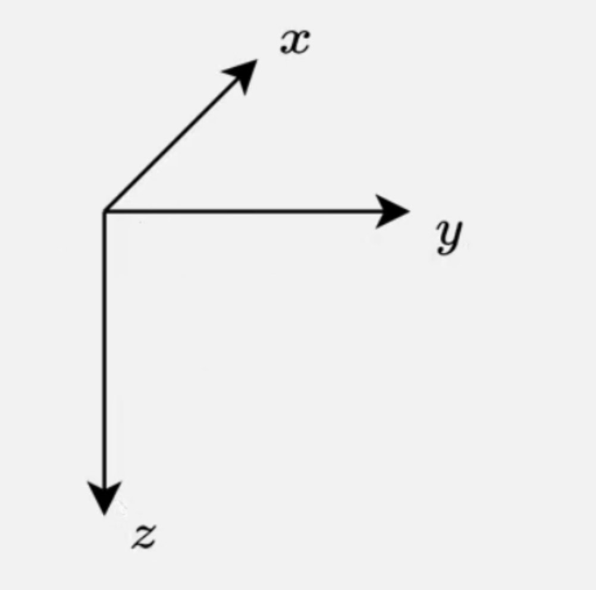
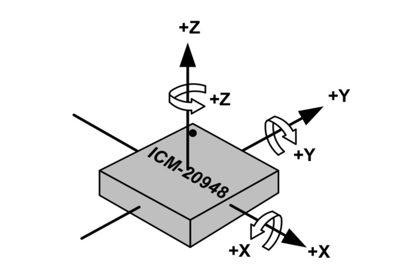
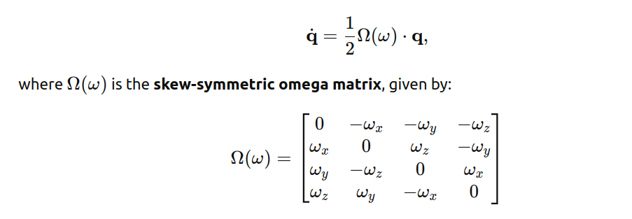
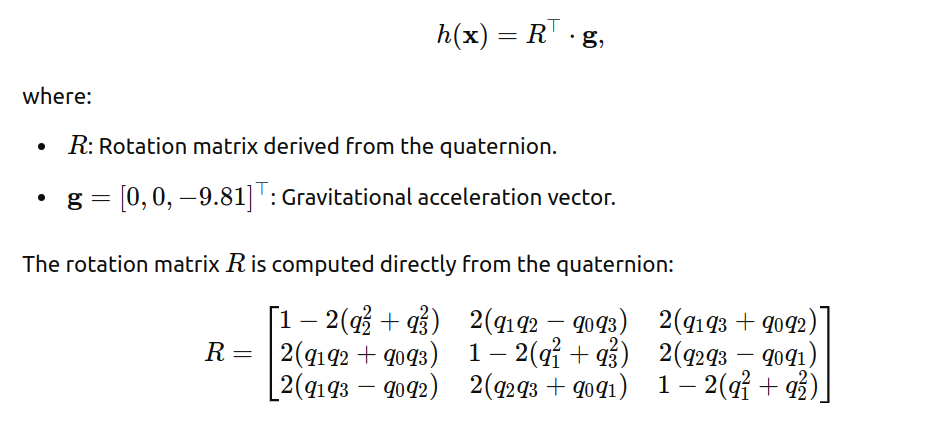
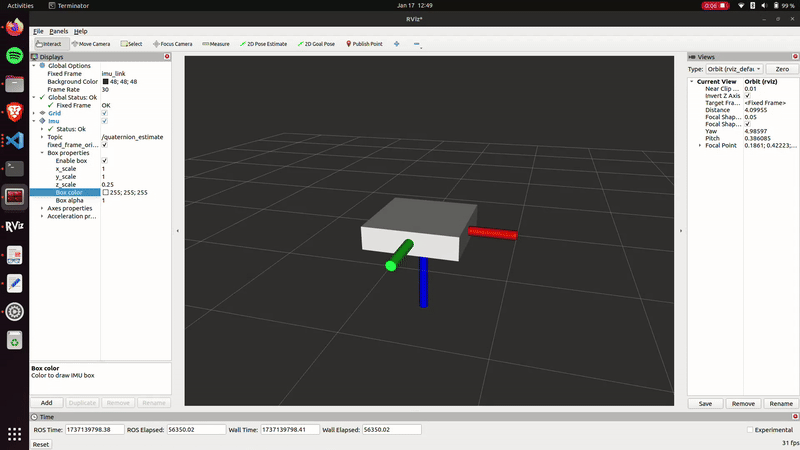

# Extended Kalman Filter for Quadcopter Attitude Estimation in Rust

## Abstract

This project implements an Extended Kalman Filter (EKF) in Rust to estimate the attitude of a quadcopter using real-time gyroscope and accelerometer data. The EKF takes gyroscope data (in radians/second), accelerometer data (in meters/second²), and a time step (in seconds) as inputs and outputs an estimated orientation as a quaternion. The filter uses gyroscope data and quaternion dynamics to predict the state, then refines the estimate by incorporating accelerometer data.

The implementation is fully integrated into a seperate ROS2 Rust robotics project, demonstrating its practical application in robotics with real-world IMU data. Leveraging Rust’s high performance and memory safety, the EKF provides a robust and extensible solution for state estimation in dynamic systems.

This EKF serves as a critical component of the quadcopter's control system, enabling precise attitude estimation for stable flight. It also highlights Rust’s potential as a powerful language for robotics applications. The accompanying README provides a detailed explanation of the theoretical foundations, design decisions, and implementation specifics, making it a valuable resource for engineers and developers exploring Rust-based robotics.

How to Use `rust-ekf`

## How to Use `rust-ekf`

The `rust-ekf` library can be used in your Rust projects to implement an Extended Kalman Filter for state estimation. Follow the steps below to integrate it into your project.

### Adding `rust-ekf` as a Dependency

You can include `rust-ekf` as a dependency in your `Cargo.toml` by referencing the GitHub repository. Add the following lines to your `Cargo.toml`:

	[dependencies]
	rust-ekf = { git = "https://github.com/OrlandoQuintana/rust-ekf.git" }
This tells Cargo to pull the library directly from the GitHub repository and use it in your project.

----------

### Importing `rust-ekf` into Your Code

To use the library in your Rust code, import the `EKF` struct at the top of your file. 

Example:

	use rust_ekf::EKF;

This makes the `EKF` struct available for use in your code.

----------

### Using the `rust-ekf` Code Locally

If you prefer to clone the `rust-ekf` repository and use it as a local dependency, follow these steps:

1.  Clone the repository to your local machine:

		git clone https://github.com/OrlandoQuintana/rust-ekf.git
2. Place the cloned repository in a desired location on your computer.
3. Add the local path to your `Cargo.toml` dependencies:

		[dependencies]
		rust-ekf = { path = "../path/to/rust-ekf" }
	Replace `../path/to/rust-ekf` with the actual relative path to the `rust-ekf` folder.

### Example Usage in Your Code

Here’s an example of how you might use the `rust-ekf` library:
		
	use rust_ekf::EKF;

	fn main() {
	    // Create a new EKF instance
	    let mut ekf = EKF::new();

	    // Example gyroscope data (roll rate, pitch rate, yaw rate in rad/s)
	    let gyro_data = [0.01, -0.02, 0.03];
        let dt = 0.005; 

	    // Prediction phase
	    ekf.predict(gyro_data, dt);

	    // Example accelerometer data (x, y, z acceleration in m/s^2)
	    let accel_data = [0.0, 9.81, 0.0];

	    // Update phase
	    ekf.update(accel_data);

	    // Get the updated state vector
	    let state = ekf.get_state();
	    println!("Updated State Vector: {:?}", state);
	}

Extended Kalman Filter Purpose

## Extended Kalman Filter Purpose

Accurate attitude estimation is critical for quadcopter control, requiring sensor fusion due to the strengths and limitations of individual sensors:

-   **Gyroscope**: Measures angular velocity with high precision over short periods. However, it is prone to drift over time due to the absence of a stable reference like gravity, causing accumulated errors in measurements.
    
-   **Accelerometer**: Measures linear acceleration, including the constant effect of gravity, making it an excellent long-term reference for orientation. However, accelerometers are highly sensitive to high-frequency vibrations and rapid movements, making their short-term measurements noisy and unreliable.
    

By combining these sensors, we can achieve robust short-term and long-term attitude estimates:

-   The gyroscope serves as the primary sensor for the prediction phase of the EKF, offering accurate short-term dynamics.
-   The accelerometer provides long-term stability during the update phase, correcting the gyroscope's drift by referencing gravity.

This complementary fusion leverages the strengths of both sensors to produce a more reliable and accurate estimation of the quadcopter's attitude.

Design Decisions

## Design Decisions

This section outlines the key design decisions made during the implementation of the Extended Kalman Filter (EKF) for quadcopter attitude estimation and provides justifications for each choice.

----------

### 1. Quaternion Estimaton vs. Euler Estimation

Aircraft attitude is often described using Euler angles (roll, pitch, and yaw). Euler angles are intuitive and easy to understand because they provide a 3D representation of the aircraft's orientation in space. However, they come with significant drawbacks that make them less suitable for real-time attitude estimation in dynamic systems like quadcopters. These drawbacks include:

1.  **Gimbal Lock**: A mathematical singularity that occurs when one of the Euler angles reaches ±90° (e.g., pitch = 90°). In this state, the system loses one degree of freedom, making it impossible to represent certain orientations. This can lead to numerical instability and unpredictable behavior in control systems.
2.  **Angle Wrapping**: Euler angles are cyclic, meaning they wrap around at ±180° or 360°. This creates discontinuities that require manual handling, such as unwrapping angles, which complicates algorithms and introduces potential errors.
3.  **Computational Complexity**: Combining multiple rotations using Euler angles requires trigonometric functions (e.g., sine and cosine), which are computationally expensive and can lead to performance bottlenecks in real-time systems.

To address these issues, this EKF implementation uses quaternions for attitude estimation. Quaternions are a four-dimensional representation of orientation made up of a scalar `w` and a vector `[x, y, z]`. These values together form a quaternion, which can be written as `q = w + xi + yj + zk`. Quaternions  offers several advantages including:

1. **No Gimbal Lock**: Quaternions avoid singularities entirely, ensuring smooth and continuous representation of all possible orientations.
2. **No Angle Wrapping**: Quaternions do not suffer from cyclic discontinuities, eliminating the need for angle unwrapping and simplifying algorithms.
3. **Computational Efficiency**: Quaternion operations (e.g. multiplication, interpolation) are computationally efficient and avoid the need for trigonometric functions, making them ideal for real-time systems.
4. **Robustness**: Quaternions provide a more stable and numerically robust representation of orientation, especially in dynamic systems like quadcopters where rapid changes in attitude are common.

By using quaternions, this Extended Kalman Filter (EKF) implementation achieves smoother and more reliable attitude estimation, making it well-suited for real-world robotics applications like quadcopter control.

### 2. Expanded State Vector

Many aircraft attitude estimations using EKF, like the one found in _Small Unmanned Aircraft: Theory and Practice_ by Randall W. Beard and Timothy W. McLain (a key inspiration for this project) include only **roll and pitch Euler angles** in their state vectors. This is because only roll and pitch can be both predicted (using gyroscope data) and updated (using accelerometer data). Yaw, however, cannot be updated by accelerometer data, as it is independent of gravity.

This EKF implementation takes a more comprehensive approach by:

1. **Using Quaternions Instead of Euler Angles**: The state vector includes a full quaternion (`w, x, y, z`) for orientation estimation, avoiding the limitations of Euler angles.
2. **Including Yaw Estimation**: Despite not having a sensor (e.g., magnetometer or GPS) to update yaw directly, the state vector includes a yaw-like estimate as part of the quaternion. This allows for a complete 3D orientation representation and supports future integration of yaw-correcting sensors.
3. **Adding Angular Rates**: The state vector also includes roll, pitch, and yaw rates, enabling more robust and consistent attitude estimation.

The full state vector is defined as: 

-   **w**: The real part of the quaternion
-   **x**: The coefficient of the `i` component.
-   **y**: The coefficient of the `j` component.
-   **z**: The coefficient of the `k` component.
-   **Roll Rate**: Angular velocity around the x-axis.
-   **Pitch Rate**: Angular velocity around the y-axis.
-   **Yaw Rate**: Angular velocity around the z-axis.

This expanded state vector provides a more comprehensive attitude estimation, making it adaptable to more complex systems and future sensor integrations.

----------

#### **Yaw Angle**

-   **Why it's critical**: Yaw is essential for flight control and navigation, as it determines the quadcopter's heading..
-   **Challenges with yaw**: Unlike roll and pitch, yaw is independent of gravity (rotation around the z-axis does not relate to the gravitational force). This makes it impossible to use accelerometer data to correct for drift in yaw estimation.
-   **Current approach**: Yaw estimation is included in the prediction phase of the EKF but excluded from the update phase since no yaw-correcting sensor (e.g., magnetometer, GPS, or vision) is currently used.
-   **Future considerations**: This design supports future expansion when sensors like GPS or a vision system are introduced, enabling yaw correction. So even though yaw is excluded from the update phase of this EKF, it remains in the model to provide an initial prediction and act as a placeholder for other sensor data to perform the update in the future.

----------

#### **Roll, Pitch, and Yaw Rates**

Many EKF implementations exclude angular rates from the state vector, assuming the use of high-quality, pre-filtered sensor data. However, this implementation includes roll, pitch, and yaw rates for the following reasons:

-   **Handling noisy gyro data**: The EKF inherently filters noise via the process noise covariance matrix (Q), making it a robust option for filtering angular rates.
-   **Consistency across the system**: Gyro data is a key input for downstream cascaded PID controllers in the quadcopter's flight system. Including angular rates in the EKF ensures consistency between the estimated attitude and the rates used for control, avoiding potential discrepancies from separate filtering methods.
-   **Drift correction**: Unlike standalone filters (e.g., low-pass filters), the EKF can correct for gyro drift, ensuring long-term accuracy in angular rate estimation.

----------

#### **Angular Accelerations**

The EKf **does not** include angular accelerations (accelerometer data) in the state vector because:

-   **Computational Complexity**: Adding three more states to the state vector would introduce excessive computational complexity, reducing real-time performance.
-   **Downstream Role of Accelerometer Data**: Accelerometer data does not play as critical a role downstream as gyroscope data. It is not directly tied to the attitude estimate used in the PID controller.
-   **Pre-filtering**: Accelerometer data is noisy and sensitive to vibrations, but it can be adequately filtered outside of the EKF using a low-pass Butterworth filter. Unlike gyroscope data, accelerometer data does not suffer from drift over time, making external filtering sufficient.

----------

### 3. Programming Language: Rust

The decision to implement the EKF in Rust is driven by several factors:

-   **Performance and safety**: Rust provides high performance comparable to C++ while ensuring memory safety.
-   **Adoption in robotics**: Rust is increasingly used in robotics and embedded systems due to its modern features and ecosystem.
-   **Limited Rust EKF resources**: By creating a well-documented EKF implementation, this project contributes to the growing Rust robotics community, offering a reusable, open-source solution.

----------

### 4. Modularity and Expandability

The EKF implementation has been designed with modularity and future expandability in mind:

-   **Modularity**: Key matrices (state vector, covariance matrix, Q, and R) are defined in the EKF struct and initialized at creation, making the implementation easy to extend.
-   **Expandability**: The design anticipates adding more sensors (e.g., GPS, vision) to improve yaw correction and overall attitude estimation accuracy.

----------

### Technical Requirements

1.  **Rust Installation**  
    Rust must be installed on your computer. Follow the official Rust installation guide.
    
2.  **IMU Data**
    
    -   **Units**:
        -   Gyroscope data must be in **rad/s** for all three axes (roll, pitch, yaw).
        -   Accelerometer data must be in **m/s²** for all three axes.
    -   **Orientation**:  
        Ensure your IMU data is oriented according to the **standard EKF frame of reference**:
        -   x: Positive in the north direction.
        -   y: Positive in the east direction.
        -   z: Positive in the down direction.
    -   **Unit Conversion**:  
        Most IMU sensors output raw data that needs to be converted to the required units. Ensure proper scaling and calibration are applied to get consistent measurements in rad/s and m/s².
3.  **Orientation Visualization**  
    The expected orientation for IMU data in an EKF can be seen in the image below:  
    _
    
4.  **Non-Standard IMU Orientation**  
    If your IMU orientation differs from the standard EKF frame, you must adjust your data to match.
    
    -   Example: For my application, I used an **ICM-20948 IMU**, which has a non-standard orientation:
        -   y: Positive in the north direction.
        -   x: Positive in the east direction.
        -   z: Positive in the up direction.
    -   Correction applied:
        -   Flip x and y data.
        -   Multiply z data by −1.
    
    A visualization of the ICM-20948 IMU orientation is shown below:  
    _
    

----------

### Practical Requirements

1.  **System Modeling**  
    The EKF estimates a system's state by combining:
    
    -   **Measurement Data**: Obtained from sensors such as gyroscopes and accelerometers.
    -   **Kinematic and Dynamic Models**: Mathematically describe the motion and forces acting on the system.
2.  **Understanding Your System**  
    To apply an EKF to your specific system:
    
    -   You must derive the **dynamic model** and **measurement model** for your system.
    -   Partial derivatives (Jacobians) of these models with respect to the state vector components must be calculated.
    -   This requires a solid understanding of your system's physics and kinematics.
3.  **EKF-Specific Models in This Implementation**
    
    -   **Dynamic Model, Measurement Model, Dynamic Jacobians, and Measurement Jacobians**:
        -   Derived from the book _"Small Unmanned Aircraft: Theory and Practice"_ by Randall W. Beard and Timothy W. McLain.
        -   Modified to use quaternion estimation and fit the expanded state vector used in this EKF for quadcopter attitude estimation.
    -   These models are discussed in further detail later in this document.
4.  **General Applicability**  
    While this EKF is specifically designed for quadcopter attitude estimation, the principles and structure can be adapted to other systems. However, dynamic and measurement models, along with their respective Jacobians, must be developed for each unique system.

Code Setup

## Code Setup

### Importing the `nalgebra` Crate

[`nalgebra`](https://nalgebra.org/) is a powerful Rust crate (library) for performing linear algebra operations. It provides essential traits and methods for working with matrices and vectors, which are critical for implementing the matrix math required by an EKF. To use it, add `nalgebra` as a dependency in your project's `Cargo.toml` file.

The following line imports the specific types we'll be using:

	use nalgebra::{Matrix, Matrix4, Const, Vector3};

Because of the "odd" size of our state vector (size 7) we must create custom Vector/Martrix types using built in nalgebra methods. This is done here:

    type Vector7 = Matrix<f64, Const<7>, Const<1>, nalgebra::ArrayStorage<f64, 7, 1>>;
    type Matrix7 = Matrix<f64, Const<7>, Const<7>, nalgebra::ArrayStorage<f64, 7, 7>>;
    type Matrix3 = Matrix<f64, Const<3>, Const<3>, nalgebra::ArrayStorage<f64, 3, 3>>;
    type Matrix3x7 = Matrix<f64, Const<3>, Const<7>, nalgebra::ArrayStorage<f64, 3, 7>>;
    type Vector4 = Matrix<f64, Const<4>, Const<1>, nalgebra::ArrayStorage<f64, 4, 1>>;

These types simplify the process of defining and manipulating matrices and vectors in our EKF implementation.

### Declare constants

	pub const GRAVITY: f64 = 9.81; // Gravitational constant (m/s^2)
In Rust, constants are defined using the `const` keyword. They must have an explicitly declared type (`f64` in this case) and are evaluated at compile time, making them immutable.

Rust's privacy model makes all items private by default. To make the `GRAVITY` constant accessible outside of this module, we use the `pub` keyword, which designates it as public.

### Creating the EKF Struct

Rust does not follow a traditional object-oriented paradigm because it lacks inheritance and runtime polymorphism. However, it supports struct-based programming, which allows grouping related data fields into a single logical unit. For our EKF, we define a struct as follows:

	// EKF Struct
    pub struct EKF {
        pub state: Vector7,                 // State vector: [q0, q1, q2, q3, ωx, ωy, ωz]
        pub covariance: Matrix7,            // Covariance matrix P
        pub process_noise: Matrix7,         // Process noise Q
        pub measurement_noise: Matrix3,     // Measurement noise R
    }

This struct encapsulates the key components required for the EKF:

-   **State Vector (`state`)**: Tracks the system's state, including the quaternion and angular rates.
-   **Covariance Matrix (`covariance`)**: Represents the uncertainty of the state estimate.
-   **Process Noise (`process_noise`)**: A matrix representing system noise (Q), tuned for the specific dynamics of the system.
-   **Measurement Noise (`measurement_noise`)**: A matrix representing sensor noise (R), also tuned experimentally.

Key points about Rust structs:

-   Fields within the struct must be explicitly typed.
-   Fields are private by default but can be made public by prefixing them with the `pub` keyword, as seen here.
-   By using the `nalgebra` crate, the matrices and vectors in the struct are represented using optimized data structures for linear algebra.

This struct serves as the foundation for our EKF, holding all the necessary data and configuration for both the **predict** and **update** phases.

### Create a New EKF Instance

In Rust, an instance of a struct is created using an implementation block (`impl`). This allows us to define methods associated with the struct, such as constructors, functions, and utilities. The `new` function is a commonly used convention for constructing a new instance of the struct. When we create a new instance of the EKF struct we need to initialize the initial state vector, the covariance matrix, and the noise matrices Q and R.

The aircraft whose attitude we are estimating may not always be in the same orientation at startup, meaning we need to calculate the attitude as closely as we can to give the EKF a good initial state. If we were to just give the EKF an arbitrary staring point like an identity quaternion (`(1, 0, 0, 0)') it would technically eventually correct itself to the true orientation using the accelerometer's representation of gravitational acceleration, but there will be an inevitable delay in this correction.

An industry standard approach is to calculate a rough estimate of the orientation at startup using the acceleromater data and then allowing the EKF to take over from a more accurate initial state. We do that inside of the `new` function here:

    impl EKF {
        /// Create a new EKF instance, passing accelerometer data to calculate the initial quaternion (avoids using 0's for initial orientation)
        pub fn new(accel_data: Option<[f64; 3]>) -> Self {
            let (q0, q1, q2, q3) = if let Some(accel_data) = accel_data {
                // Normalize accelerometer vector
                let norm = (accel_data[0].powi(2) + accel_data[1].powi(2) + accel_data[2].powi(2)).sqrt();
                let ax = accel_data[0] / norm;
                let ay = accel_data[1] / norm;
                let az = -accel_data[2] / norm;
        
                // Calculate quaternion from accelerometer data
                let q0 = (1.0 + az).sqrt() / 2.0;
                let q1 = -ay / (2.0 * q0);
                let q2 = ax / (2.0 * q0);
                let q3: f64 = 0.0; // Yaw is zero since accelerometer data cannot calulcate yaw angles

                // Normalize the quaternion
                let norm = (q0.powi(2) + q1.powi(2) + q2.powi(2) + q3.powi(2)).sqrt();
                let q0 = q0 / norm;
                let q1 = q1 / norm;
                let q2 = q2 / norm;
                let q3 = q3 / norm;
                

                (q0, q1, q2, q3)
            } else {
                // Default to identity quaternion
                (1.0, 0.0, 0.0, 0.0)
            };
        
The EKF struct also calls for the noise matrices Q and R. These matrices are static, meaning they do not change with each iteration of the EKF. We must initialize them at the creation of the EKF instance, and we do so in a way that makes experimantel tuning easier:

        // Initialize process and measurement noise matrices
        let mut process_noise = Matrix7::zeros();
        process_noise[(0, 0)] = 1e-7; // q0
        process_noise[(1, 1)] = 1e-7; // q1
        process_noise[(2, 2)] = 1e-7; // q2
        process_noise[(3, 3)] = 1e-7; // q3
        process_noise[(4, 4)] = 1e-5; // ωx
        process_noise[(5, 5)] = 1e-5; // ωy
        process_noise[(6, 6)] = 1e-5; // ωz
        
        let mut measurement_noise = Matrix3::zeros();
        measurement_noise[(0, 0)] = 1e-1; // accel x
        measurement_noise[(1, 1)] = 1e-1; // accel y
        measurement_noise[(2, 2)] = 1e-1; // accel z 

Those indices of each matrix are explicitly set because they will be tuned experimentally. Users should run the EKF, observe the behavior of the estimate, and adjust these values accordingly.

Now we can return the EKF instance:

        EKF {
            state: {
                let mut state = Vector7::zeros();
                state[0] = q0;
                state[1] = q1;
                state[2] = q2;
                state[3] = q3;
                state[4] = 0.0; // ωx
                state[5] = 0.0; // ωy
                state[6] = 0.0; // ωz
                state
            },
            covariance: Matrix7::identity() * 1.0, // Initial state covariance
            process_noise,
            measurement_noise,
        }
    }

----------

#### Initialization Details

1.  **State Vector (`state`)**:  
    The state vector is initialized as using a quaternion determined by accelerometer data. This vector represents the initial "assumed" state of the system. The state vector is dynamic, meaning it will be updated in every iteration of the EKF to reflect the estimated system state.
    
2.  **Covariance Matrix (`covariance`)**:  
    The covariance matrix is initialized as an identity matrix, scaled by a magnitude of `1.0`. This represents initial uncertainty in the state estimation. Like the state vector, the covariance matrix is dynamic and evolves with each EKF iteration based on the prediction and update steps. 1.0 is an arbitrary uncertainty.
    
3.  **Process Noise Matrix (`process_noise`)**:  
    The process noise matrix (`Q`) accounts for uncertainty or errors in the system dynamics model. It is initialized as an identity matrix with indices scaled by some experimentallu tuned values. It remains static during EKF iterations.
    
4.  **Measurement Noise Matrix (`measurement_noise`)**:  
    The measurement noise matrix (`R`) accounts for noise or errors in the sensor data. It is initialized as an identity matrix with indices scaled by some experimentallu tuned values. Like `Q`, it remains static during EKF iterations.

The `new` method ensures that all fields of the EKF struct are properly initialized with starting values. This approach centralizes the initialization logic, ensuring consistency and reducing errors when creating new EKF instances. It also makes the EKF flexible for modifications, such as tuning the noise matrices (`Q` and `R`).

This constructor reflects Rust's strong emphasis on safety and correctness by requiring explicit initialization for all fields, ensuring the EKF starts with well-defined values.  

The Extended Kalman Filter

# The Extended Kalman Filter

The Extended Kalman Filter (EKF) consists of two main phases: the **Prediction Phase** and the **Update Phase**. Each phase plays a critical role in estimating the state of the system (in this case, the quadcopter's attitude) by combining dynamic modeling and sensor measurements. Below is a high-level outline of the steps in each phase. Subsequent sections will provide detailed explanations of these steps, including both the theoretical basis and practical implementation in Rust.

----------

### **Prediction Phase**

The **Prediction Phase** uses the system's dynamics to estimate the next state of the system and the associated uncertainty. This phase is driven by the dynamic model of the system.

1.  **Compute the Dynamic Model, f(x, u):**  
    Use the system's dynamics to calculate how the state evolves over time, based on the previous state and control inputs (if any). This accounts for how the quadcopter's attitude changes based on gyroscope readings.
    
2.  **Update the State Vector:**  
    Use the computed dynamic model to update the state vector, which represents the system's estimated attitude and angular rates.
    
3.  **Calculate the Dynamics Jacobian:**  
    Derive the partial derivatives of the dynamic model with respect to the state vector to compute the dynamics Jacobian matrix, which captures how small changes in the state affect the dynamics.
    
4.  **Update the Covariance Matrix:**  
    Use the dynamics Jacobian and the process noise matrix (Q) to update the covariance matrix, which represents the uncertainty in the state estimation.
    

----------

### **Update Phase**

The **Update Phase** incorporates sensor measurements (in this case, accelerometer data) to correct the predicted state and reduce uncertainty. This phase ensures long-term accuracy by counteracting drift in the gyroscope's estimates.

1.  **Compute the Measurement Model, h(x, u):**  
    Use the measurement model to predict what the sensor measurements should be based on the current state estimate.
2.  **Compute the Innovation:**  
    Calculate the difference between the actual sensor measurements and the predicted measurements from the measurement model. This difference (called the innovation) indicates how much correction is needed.
    
3.  **Compute the Measurement Jacobian:**  
    Derive the partial derivatives of the measurement model with respect to the state vector to compute the measurement Jacobian matrix, which captures how the state affects the sensor measurements.
    
4.  **Compute the Innovation Covariance:**  
    Use the measurement Jacobian, covariance matrix, and measurement noise matrix R to compute the innovation covariance, which represents the uncertainty in the innovation.
    
5.  **Compute the Kalman Gain, K:**  
    Calculate the Kalman Gain, which balances the trust between the predicted state and the sensor measurements when updating the state.
    
6.  **Update the State Vector:**  
    Use the Kalman Gain and the innovation to update the state vector, correcting the predicted state using the sensor measurements.
    
7.  **Update the Covariance Matrix:**  
    Use the Kalman Gain and the measurement Jacobian to update the covariance matrix, reducing uncertainty in the corrected state estimate.
    

----------

This structure outlines the logical flow of the EKF and highlights the roles of the dynamic and measurement models, as well as the iterative process of combining predictions with sensor corrections. Each step ensures that the system state estimate is as accurate as possible while accounting for uncertainty in both the system's dynamics and the sensor data.

Prediction Phase

## Prediction Phase

The **Prediction Phase** estimates the system's next state based on the current state and the system's dynamics. In our implementation, this entire phase is encapsulated in the `predict` method. This method computes the dynamic model, updates the state vector, and calculates the dynamics Jacobian and covariance matrix.

### Declaring the Predict Method

We start by creating the `predict` method and declaring it as public using `pub fn`. The method takes 2 arguments `gyro`, which is an array of size 3 (`[f64; 3]`) containing gyroscope data for the x, y, and z axes in units of rad/s (angular velocities) and `dt` which is the timestep in seconds. The time step can be constant if you can guarantee that the system is operating at a constant frequency. For real-world systems it is common to calculate the exact time step during each iteration to ensure the EKF is using the true time step and not an assumed timestep. 

    pub fn predict(&mut self, gyro: [f64; 3], dt: f64) {

----------

### Compute the Dynamic Model: f(x, u)

The dynamic model, f(x,u), describes how the state evolves over time based on the system's dynamics. In the case of the quadcopter, it predicts the quaternion using gyroscope data and the previously estimated quaternion. This nonlinear propagation model ensures that the state vector reflects realistic dynamics.

#### Dynamic Model Equations

The dynamic model uses the following equations for quaternion estimation:

The quaternion is integrated over time using the gyroscope data, normalized to ensure it remains a valid unit quaternion.

#### Code Implementation

The Rust implementation of the dynamic model is as follows:

        let omega = Vector3::new(gyro[0], gyro[1], gyro[2]); // gyro data vector
    
        // Extract current quaternion
        let q = Vector4::new(self.state[0], self.state[1], self.state[2], self.state[3]);
    
        // Compute quaternion derivative: q_dot = 0.5 * Ω(q) * q
        let omega_matrix = Self::omega_matrix(omega);
        let q_dot = 0.5 * omega_matrix * q;
        
        // Integrate quaternion
        let q_new = q + q_dot * dt;
    
        // Normalize quaternion to ensure quaternion remains unit quaternion
        // and set the first 4 indexes (quaternion values) to the integrated and normalized
        // values, q_new
        let norm = q_new.norm();
        if norm > 0.0 {
            let q_new = q_new / norm;
            self.state[0] = q_new[0];
            self.state[1] = q_new[1];
            self.state[2] = q_new[2];
            self.state[3] = q_new[3];
        }

        // Update angular velocity in state vector with the gyro measurements
        self.state[4] = gyro[0];
        self.state[5] = gyro[1];
        self.state[6] = gyro[2]; 
#### Explanation of the Code

1.  **omega**: Gyro data vector using angular velocities around each axis
2.  **q**: The current quaternion, extracted from the state vector.
3.  **Normalization**: Quaternions must always be normallized to account for small accumulating errors.
4.  **State Vector Update**: The state vector is updated with the predicted quaternion and the most recent gyroscope data.

This step computes the dynamic evolution of the state vector using only gyroscope data and the dynamic model. In subsequent steps, this model's output will be used to update the state vector and the covariance matrix. Each component of the state vector is updated iteratively during this step based on the dynamic model.

----------

### Compute the Dynamic Jacobian

The **Dynamic Jacobian** (∂f/∂x​) is a first-order linear approximation that quantifies how the state vector components influence each other in a nonlinear dynamic system. It is a matrix of partial derivatives, where each element represents the sensitivity of one state variable's rate of change to changes in another state variable.

#### The Jacobian Matrix

For a state vector of size `n`, the Jacobian is an `n×n`  matrix. Each row contains the partial derivatives of the time derivative of one state variable with respect to all components of the state vector.

To calculate our Dynamic Jacobian Matrix we use a custom method called `compute_f_jacobian` which receives gyroscope data and timestep, `dt` as input and returns an `nxn` jacobian matrix.

        // Compute dynamic Jacobian (∂f/∂x) using custom compute_f_jacobian method
        let f_jacobian = self.compute_f_jacobian(gyro, dt);

        .
        .
        .

`compute_f_jacobian` method:

    /// Compute the dynamic Jacobian (∂f/∂x)
    fn compute_f_jacobian(&self, gyro: [f64; 3], dt: f64) -> Matrix7 {
        let p = gyro[0];
        let q = gyro[1];
        let r = gyro[2];

        let mut f = Matrix7::identity();
        f[(0, 1)] = -p * dt;
        f[(0, 2)] = -q * dt;
        f[(0, 3)] = -r * dt;
        f[(1, 0)] = p * dt;
        f[(1, 2)] = r * dt;
        f[(1, 3)] = -q * dt;
        f[(2, 0)] = q * dt;
        f[(2, 1)] = -r * dt;
        f[(2, 3)] = p * dt;
        f[(3, 0)] = r * dt;
        f[(3, 1)] = q * dt;
        f[(3, 2)] = -p * dt;
        f
    }    

### Update the Covariance Matrix

The final step in the **Prediction Phase** is updating the **Covariance Matrix**, which represents the uncertainty in the state estimate. This step accounts for how the system dynamics and process noise contribute to the uncertainty. The mathematical equation for this update is:

where:

-   P: The covariance matrix, which was initialized as an identity matrix with some magnitude during the EKF initialization.
-   Tout/N: The time step (dt).
-   A: The Jacobian matrix of the dynamics, (sometimes F is used) calculated earlier in the **Compute the Dynamic Jacobian** step.
-   Q: The process noise matrix, initialized during the EKF instance creation (`impl` code block). Remember that **the process noise matrix Q must be tuned experimentally** to appropriately reflect the noise in the system dynamics.

----------

#### Explanation

-   **Jacobian Matrix (A/F):** This captures how the state evolves dynamically. It propagates the uncertainty through the dynamics model f(x,u).
-   **Process Noise (Q):** Represents the uncertainty due to external or unmodeled influences on the dynamics. Since we don't have a perfect model of the quadcopter's dynamics, this matrix accounts for those inaccuracies.
-   **Time Step (dt):** Scales the entire update process to account for the rate at which the system evolves over time.

The updated covariance matrix quantifies the propagated uncertainty in the state estimate after considering how the dynamics model evolves the state.

----------

#### Code Implementation

The corresponding Rust code for updating the covariance matrix is:

        // Predict covariance using: P' = FPFᵀ + Q
        self.covariance = f_jacobian * self.covariance * f_jacobian.transpose() + self.process_noise;

1.  **Matrix Operations**:
    
    -   FPFᵀ: The covariance matrix is transformed by the Jacobian matrix (F) to propagate the uncertainty through the dynamics.
    -   Q: The process noise matrix is added to account for system noise.
    -   dt: The time step scales the entire expression.
2.  **Initialization**:
    
    -   For the first iteration, the covariance matrix P is initialized to an identity matrix scaled by 1.0.
3.  **Dynamic Update**:
    
    -   With each iteration, the covariance matrix P is updated to reflect the propagated uncertainty based on the current state, dynamics, and noise.

----------

#### Key Notes

-   **Importance of Tuning Q:** The values in the process noise matrix Q are critical to achieving good performance in the EKF. If Q is too small, the filter will overly trust the dynamics model, potentially failing to account for unmodeled behaviors. If Q is too large, the filter will become overly cautious, slowing down convergence.
-   This step ensures that the EKF properly captures the propagated uncertainty after predicting the next state.

Update Phase

## Update Phase

The **Update Phase** refines the predicted state estimate by incorporating actual sensor readings. This is where the EKF "corrects" its prediction from the **Prediction Phase** by comparing predicted measurements (from the measurement model h(x,u)) with actual measurements (from the accelerometer).

We encapsulate this entire phase in the `update` method.

At this point in the EKF, the **state vector** and **covariance matrix** have already been predicted using gyroscope data and the dynamics model. The **Update Phase** uses accelerometer measurements to further refine the state.

----------

### Compute the Measurement Model: h(x,u)

The **Measurement Model** serves a role similar to the **Dynamics Model, f(x,u)** in the prediction phase. However, instead of predicting the state evolution, the measurement model maps the current state vector to the expected sensor measurements. It defines the relationship between the state components (e.g., the quaternion) and sensor readings (e.g., accelerometer outputs).

-   The measurement model h(x,u) predicts what the sensors **should** measure, given the current state and system dynamics.
-   This is done by transforming the gravitational vector into the body frame using the rotation matrix derived from the quaternion.
-   By comparing this prediction with the actual sensor readings, the EKF identifies and corrects discrepancies, improving the state estimate.

For this EKF, the measurement model relates the **state vector** to the expected accelerometer readings. The measurement model is as follows:

#### Explanation of Components:

1.  **Gravitational Vector (g)**: The gravitational vector represents the direction and magnitude of gravity in the world frame (also called the inertial frame or global frame).
2.  **Quaternion (q)**: The quaternion `q=[w,x,y,z]` represents the orientation of the body (quadcopter) relative to the world frame. It encodes the rotation needed to transform vectors from the world frame to the body frame.
3.  **Rotation Matrix (R)**: The rotation matrix `R` is a 3x3 matrix that transforms vectors from the world frame to the body frame. It is derived directly from the quaternion `q`.
4. **Transpose of the  Rotation Matrix**: The transpose of the rotation matrix transforms vectors from the body frame back to the world frame. Since the accelerometer measures gravity in the body frame, we use the transpose of the rotation matrix to transform the gravitational vector from the world frame to the body frame.

----------

#### Code Implementation

The code implementation for the measurement model is below:

    pub fn update(&mut self, accel: [f64; 3]) {
            // Extract quaternion from the state that was estimated with dynamics + gyro data in the predict phase
            let mut q = Vector4::new(self.state[0], self.state[1], self.state[2], self.state[3]);
        
            // Compute expected accelerometer measurement using the rotation matrix (calculated from quaternion) 
            // and gravitational matrix: h(x) = R^T * g
            let gravity = Vector3::new(0.0, 0.0, -GRAVITY);
            let r_transpose = Self::quaternion_to_rotation_matrix(q).transpose();
            let accel_expected = r_transpose * gravity;

`quaternion_to_rotation_matrix` method:

    /// Convert quaternion to rotation matrix
    fn quaternion_to_rotation_matrix(q: Vector4) -> Matrix3 {
        let q0 = q[0];
        let q1 = q[1];
        let q2 = q[2];
        let q3 = q[3];

        Matrix3::new(
            1.0 - 1.0 * (q2 * q2 + q3 * q3),
            2.0 * (q1 * q2 - q0 * q3),
            2.0 * (q1 * q3 + q0 * q2),
            2.0 * (q1 * q2 + q0 * q3),
            1.0 - 1.0 * (q1 * q1 + q3 * q3),
            2.0 * (q2 * q3 - q0 * q1),
            2.0 * (q1 * q3 - q0 * q2),
            2.0 * (q2 * q3 + q0 * q1),
            1.0 - 1.0 * (q1 * q1 + q2 * q2),
        )
    }

The measurement model uses the rotation matrix derived from the quaternion to transform the gravitational vector into the body frame. This provides the expected accelerometer measurement, which is compared to the actual accelerometer reading to update the state estimate in the EKF. This approach ensures that the estimated orientation aligns with the observed sensor data.

### Compute Innovation

The **Innovation** represents the difference between the actual measurement from sensors (z) and the predicted measurement (h(x,u)), based on the current state estimate. It quantifies the discrepancy between what the sensors measure and what the EKF predicts. Mathematically, this is expressed as: $y = z - h(x, u)$

where:

-   y: Innovation.
-   z: Actual sensor measurements.
-   h(x,u): Predicted sensor measurements from the **Measurement Model**.

----------

#### Purpose of Innovation

The innovation is a crucial component in the **Update Phase**:

1.  **Small Innovation**: Indicates the prediction closely matches the actual measurement. In this case, the Kalman gain adjusts the state estimate minimally.
2.  **Large Innovation**: Suggests the prediction is significantly different from the actual measurement, requiring the Kalman gain to heavily adjust the state estimate.

The innovation directly influences the Kalman gain (K) and therefore determines how much weight the EKF assigns to the actual sensor measurements compared to the predicted state.

----------

#### Code Implementation

Below is the implementation of the innovation calculation in Rust:

        // Compute the innovation: y = z - h(x)
        let z = Vector3::new(accel[0], accel[1], accel[2]); // Measured accelerometer data
        let innovation = z - accel_expected;

### Compute the Measurement Jacobian

The **Measurement Jacobian (∂h∂x​)** is a 3×7 matrix that maps changes in the state vector to changes in the predicted accelerometer readings. Its components are derived from the quaternion-to-rotation matrix conversion and gravitational influence.

#### Purpose of the Measurement Jacobian

The Jacobian is crucial for:

1.  **Calculating the Kalman Gain**: Determines how much weight to assign to the actual measurement versus the predicted state during the update phase.
2.  **Propagating Measurement Information**: Helps incorporate sensor data to correct the state estimate and reduce uncertainty.

----------

#### Code Implementation

Below is the Rust implementation of the 3×7 Measurement Jacobian.

        // Compute measurement Jacobian (∂h/∂x) using the custom compute_h_jacobian method
        let h_jacobian = self.compute_h_jacobian(q);

`compute_h_jacobian` method:

    /// Compute the measurement Jacobian (∂h/∂x)
    fn compute_h_jacobian(&self, q: Vector4) -> Matrix3x7 {
        let q0 = q[0];
        let q1 = q[1];
        let q2 = q[2];
        let q3 = q[3];

        let mut h = Matrix3x7::zeros();
        h[(0, 0)] = 2.0 * (-GRAVITY * q2);
        h[(0, 1)] = 2.0 * (GRAVITY * q3);
        h[(0, 2)] = 2.0 * (-GRAVITY * q0);
        h[(0, 3)] = 2.0 * (GRAVITY * q1);
        h[(1, 0)] = 2.0 * (GRAVITY * q1);
        h[(1, 1)] = 2.0 * (GRAVITY * q0);
        h[(1, 2)] = 2.0 * (GRAVITY * q3);
        h[(1, 3)] = 2.0 * (GRAVITY * q2);
        h[(2, 0)] = 2.0 * (GRAVITY * q0);
        h[(2, 1)] = 2.0 * (-GRAVITY * q1);
        h[(2, 2)] = 2.0 * (-GRAVITY * q2);
        h[(2, 3)] = 2.0 * (-GRAVITY * q3);
        h
    }

### Compute the Innovation Covariance

The **Innovation Covariance** (S) quantifies the uncertainty in the innovation (y) by accounting for both:

1.  **Prediction Phase Uncertainty**: Captured by the covariance matrix P, which reflects how uncertain the state prediction is.
2.  **Measurement Noise**: Captured by the noise covariance matrix R, which represents the inherent noise in the sensor measurements.

#### Purpose of the Innovation Covariance

The innovation covariance ensures the update phase incorporates measurement data in a statistically optimal way based on relative uncertainties:

-   **Higher S**: Indicates more uncertainty in the measurement prediction. In this case, the Kalman Gain (K) will rely more heavily on the prediction and less on the measurement.
-   **Lower S**: Indicates higher confidence in the measurement prediction. The Kalman Gain will give greater weight to the measurement data.

This mechanism balances prediction and measurement contributions, ensuring robust state estimation even in the presence of noisy data.

----------

#### Mathematical Representation

The Innovation Covariance is defined as: $S = H_i P H_i^\top + R_i$

where:

-   Hi: Measurement Jacobian matrix, representing the sensitivity of the predicted sensor outputs to changes in the state vector.
-   P: Covariance matrix from the prediction phase.
-   Ri: Measurement noise covariance matrix, initialized as a 3×3 identity matrix scaled by 0.2 when the EKF instance was created. **This matrix must be tuned experimentally.**

----------

#### Code Implementation

Below is the Rust implementation of computing the Innovation Covariance:

        // Compute innovation covariance: S = HPHᵀ + R
        let s = h_jacobian * self.covariance * h_jacobian.transpose() + self.measurement_noise;
    
#### Key Points:

-   The innovation covariance S directly impacts the Kalman Gain (K) calculation, which determines how much the state estimate should be adjusted in the update phase.
-   The R matrix reflects the sensor's reliability and must be experimentally tuned to achieve an optimal balance between prediction and measurement data.

This step ensures the EKF systematically handles uncertainties, enabling accurate and reliable state estimation.

### Compute the Kalman Gain, K

The **Kalman Gain** (K) is one of the most critical components of the Extended Kalman Filter. It optimally determines how much weight to assign to the measurement versus the prediction when updating the state estimate.

#### Purpose of the Kalman Gain

K ensures the EKF dynamically balances the relative trust between:

1.  **State Prediction**: The estimate based on the model dynamics from the prediction phase.
2.  **Sensor Measurement**: The actual measurement from the sensors in the update phase.

#### Key Insights:

-   If the **measurement uncertainty R** is **low** (indicating a highly accurate sensor), K gives more weight to the measurement.
-   If the **state prediction uncertainty P** is **low** (indicating a high-confidence model prediction), K gives more weight to the prediction.
-   A **high K** means more trust in the measurement.
-   A **low K** means more trust in the prediction.

The Kalman Gain enables the EKF to adapt dynamically in real-time to changing uncertainties in the system and sensor measurements.

----------

#### Mathematical Representation

The Kalman Gain is calculated as: $K = P H_i^\top S^{-1}$

where:

-   P: Covariance matrix from the prediction phase, representing the prediction uncertainty.
-   Hi: Measurement Jacobian matrix, capturing how the state affects the measurement outputs.
-   S: Innovation covariance, quantifying the combined uncertainty of the prediction and the measurement.

----------

#### Practical Implications of K

1.  **Dynamic Balancing**: Since K is recalculated at every iteration, the EKF continuously adjusts the balance between prediction and measurement.
2.  **Optimal Fusion**: K ensures that the state update is performed in a statistically optimal way, leveraging both the system model and sensor data.
3.  **Error Reduction**: The influence of K minimizes the overall error in the state estimation.

----------

#### Code Implementation

Below is the Rust implementation of the Kalman Gain:	
		  
        // Compute Kalman gain: K = P Hᵀ S⁻¹
        let k = self.covariance * h_jacobian.transpose() * s.try_inverse().unwrap();

The Kalman Gain serves as the bridge between prediction and measurement, dynamically adjusting the system's state estimate and ensuring robust performance in a noisy environment. It reflects the adaptability and power of the EKF.

### Update the State Vector

In this step, the EKF **refines its estimate of the system state** by incorporating the sensor measurements (via the innovation) and the predicted state (via the Kalman Gain). This is the step where the “update” of the **update phase** happens.

#### Mathematical Representation:

The updated state vector is defined as: $\hat{x} = \hat{x} + K \cdot \left( y - h(\hat{x}, u) \right)$

where:

-   $\hat{x}$: Current state vector estimate (from the prediction phase).
-   K: Kalman Gain, computed earlier.
-   y: Innovation (difference between actual and predicted measurements).

The Kalman Gain (K) dynamically determines the influence of the measurement versus the prediction, and the Innovation (y) quantifies the difference between actual sensor data and predicted measurements. Together, they refine the state estimate to optimally fuse prediction and measurement.

#### Output:

In our implementation, the output of this step is the **updated state vector**, which includes:

-   **w**: The real part of the quaternion
-   **x**: The coefficient of the `i` component.
-   **y**: The coefficient of the `j` component.
-   **z**: The coefficient of the `k` component.
-   **Roll Rate**: Angular velocity around the x-axis.
-   **Pitch Rate**: Angular velocity around the y-axis.
-   **Yaw Rate**: Angular velocity around the z-axis.

----------

#### Code Implementation:

Below is the Rust implementation of updating the state vector:

        // Update state vector with new quaterion
        self.state += k * innovation;

### Update the Covariance Matrix

This is the **final step** in the Extended Kalman Filter, where the covariance matrix P is updated to reflect the reduced uncertainty after incorporating the measurement update.

#### Purpose:

The covariance matrix P quantifies the uncertainty in the state estimate. By incorporating the measurement update, the EKF reduces the uncertainty in the state estimate, which is reflected in the updated covariance matrix.

----------

#### Mathematical Representation:

The updated covariance matrix is defined as: $P = (I - K H) P$

where:

-   I: Identity matrix of the same size as the covariance matrix.
-   K: Kalman Gain.
-   H: Measurement Jacobian matrix.
-   P: Covariance matrix from the prediction phase.

This equation ensures that:

1.  The uncertainty decreases after incorporating the measurement.
2.  The covariance matrix prepares the EKF for the next prediction and update cycle.

----------

#### Code Implementation:

Below is the Rust implementation of updating the covariance matrix:

        // Update covariance: P = (I - KH)P
        let i = Matrix7::identity();
        self.covariance = (i - k * h_jacobian) * self.covariance;
    
#### Output:

The updated covariance matrix P now reflects the reduced uncertainty in the state estimate and prepares the EKF for the next prediction and update cycle.

----------

### Normalize the Quaternion

Quaternions must always be normalzied to avoid accumulating errors. It is done here at the end of the update phase just as was done at the end of the predict phase.

        let norm = q.norm();
        if norm > 0.0 {
            q = q / norm;
        }
    
        self.state[0] = q[0] / norm;
        self.state[1] = q[1] / norm;
        self.state[2] = q[2] / norm;
        self.state[3] = q[3] / norm;
        
    }

These steps complete the **update phase** of the Extended Kalman Filter. With the **prediction phase** and **update phase** combined, the EKF is now ready to iterate and continuously refine its state estimate in real-time.

Implementation and Results

----------

# Implementation and Results

The `rust-ekf` Quaternion-based Extended Kalman Filter attitude estimation was implemented in a ROS2-based quadcopter project using a raspberry pi and ICM-20948 IMU. 

A ROS2 node was written in Rust to subscribe to raw IMU data from an ICM-20948, process the data with the EKF's `predict` and `update` methods, and publish the resulting quaternion to a new ROS2 topic.

ROS2's visualization tool RViz2 was used to vizualise the attitude estimate in real time. This real-time visualization aided in tuning the Q and R matrices of the EKF to attain stable estimation that avoids gyroscope drift and quickly responds to motion. 

See the visualization below:

----------

Conclusion

# Conclusion

The implementation of this Extended Kalman Filter (EKF) for quadcopter attitude estimation combines theoretical foundations, deliberate design decisions, and practical coding in Rust. 

The design is modular and future-proof, enabling seamless integration of additional sensors, such as GPS or vision systems, without major rewrites. Incorporating angular velocity estimates directly into the state vector leverages the EKF’s ability to filter noisy gyroscope data, ensuring more reliable attitude estimation. This capability is crucial in robotics, where precise state estimation is essential for stable flight, navigation, and control.

The choice of Rust reflects the language’s growing role in robotics, offering memory safety, high performance, and a modern type system. Rust’s strengths make it well-suited for implementing critical systems like the EKF, enabling the creation of robust and efficient code for safety-critical applications.

This EKF implementation is both a practical tool for quadcopter attitude estimation and a demonstration of Rust’s potential in robotics. By combining proven theoretical models with modern programming practices, this project provides a scalable and reliable solution for real-world robotics challenges.

